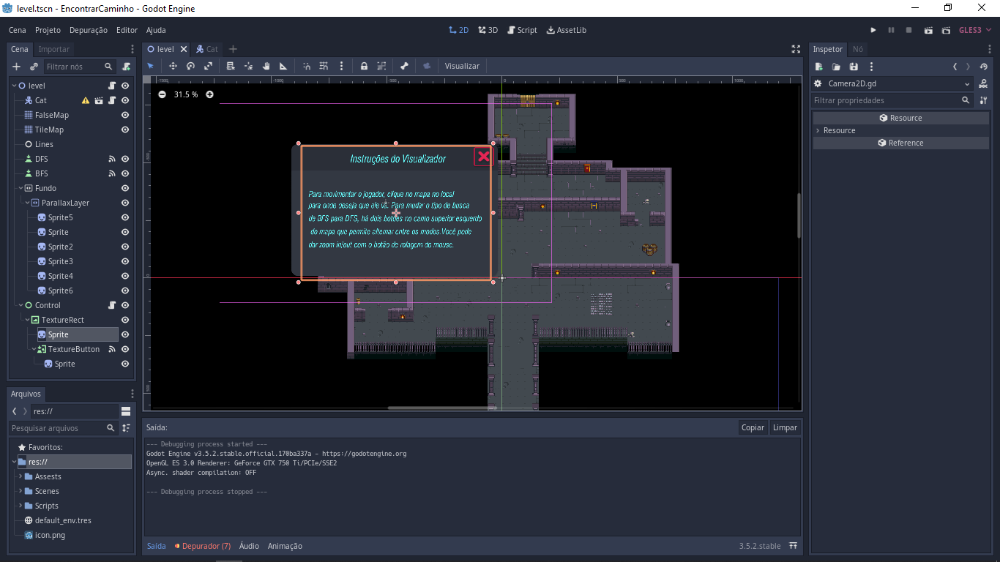
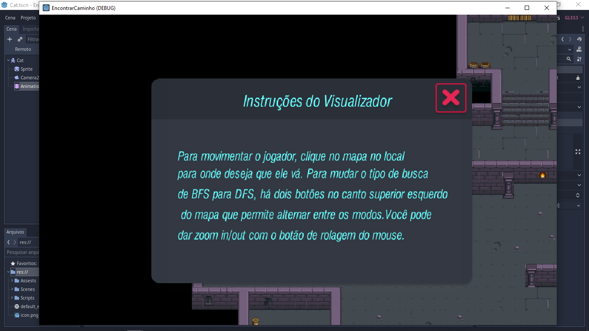
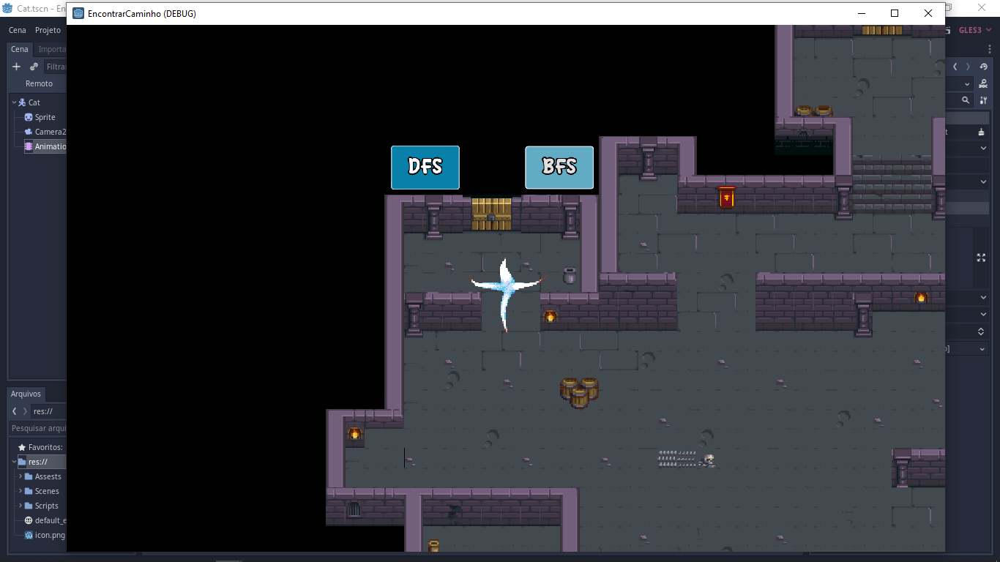
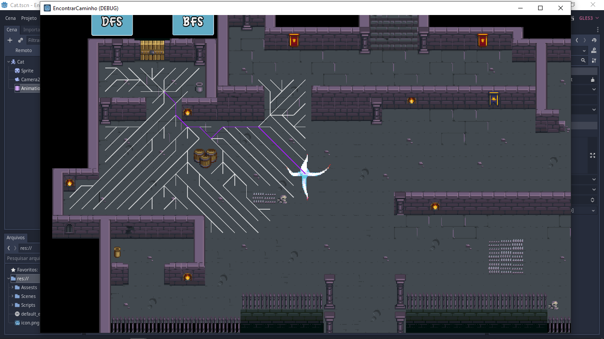

# Encontrando Caminho

**Número da Lista**: X 
**Conteúdo da Disciplina**: Grafos 1 

## Alunos
|Matrícula | Aluno |
| -- | -- |
| 17/0154319  |  Philipe de Sousa Barros |

## Sobre 

Este é um projeto de visualização de busca de caminhos que utiliza os algoritmos de busca em largura (BFS) e busca em profundidade (DFS) para encontrar caminhos em um sistema de grade. O projeto foi desenvolvido na Godot Engine, uma poderosa ferramenta de criação de jogos e aplicativos interativos

## Video de Apresentação
O arquivo do vídeo (.mp4) da apresentação do projeto se encontra na pasta video -> [video](https://github.com/projeto-de-algoritmos/Grafos1_EncontrandoCaminho/blob/master/video/grafos1_video.mp4)

## Screenshots

Tela do Editor

Instruções de uso

Tela inicial do visualizador

Visualização das linhas no mapa

## Instalação 
**Linguagem**: GDscript 
**Framework**: (caso exista) 

### Pré-requisitos

Antes de rodar o projeto, certifique-se de ter os seguintes pré-requisitos instalados em sua máquina:

- [Godot Engine](https://godotengine.org/) versão 3.5.2 ou superior
- Arquivo ZIP do projeto, que pode ser baixado [aqui](https://github.com/projeto-de-algoritmos/Grafos1_EncontrandoCaminho/archive/refs/heads/master.zip)

### Como rodar o projeto

1. Baixe a versão 3.5.2 ou superior da Godot Engine do site oficial e instale em sua máquina.

2. Baixe o arquivo ZIP do projeto [aqui](https://github.com/projeto-de-algoritmos/Grafos1_EncontrandoCaminho/archive/refs/heads/master.zip) e descompacte em uma pasta de sua escolha.

3. Abra a Godot Engine e clique em "Importar" na tela inicial.

4. Navegue até a pasta onde descompactou o arquivo ZIP do projeto e selecione o arquivo `project.godot`.

5. Na janela de importação que abrir, deixe as configurações padrão e clique em "Importar".

6. Com o projeto importado, clique no botão "Executar" no topo da interface para rodar o jogo.

## Outros 
Quaisquer outras informações sobre seu projeto podem ser descritas abaixo.

